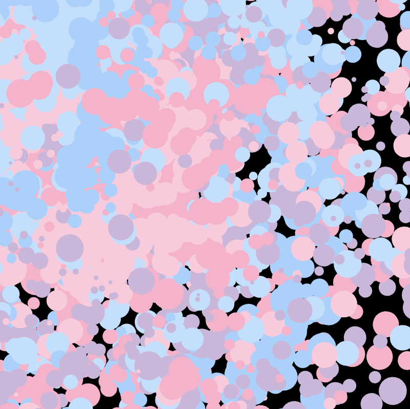
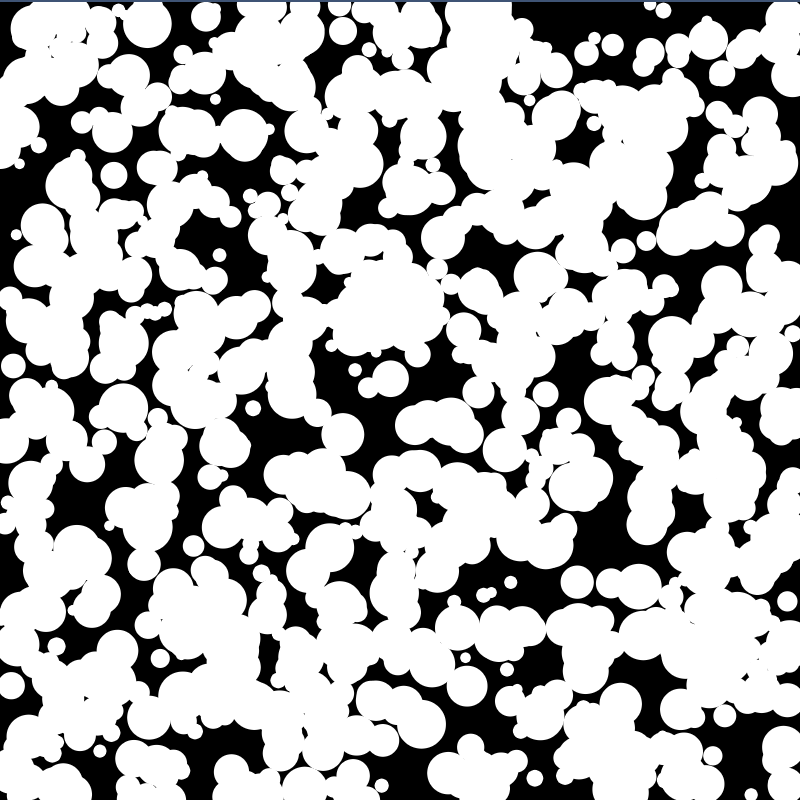

# Playing with p5.js

A collection of generative art sketches, interactive simulations, and algorithm visualizations created using the p5.js library. Explore the different experiments below!

| Creation 1 | Creation 2 | Creation 3 |
|---|---|---|
|  |  |  |
| **Falling Sand** | **Flow Field** | **Flow Field Pro** |
|  |  |  |
| **Mandelbrot** | **Confeti** | **Shapes** |
|  |  |  |
| **Spirals** | **Trazos Original** | **Black and White Noise** |
|  |  |  |
| **Nature of Code - Vectors** | **Particle Systems** | **Pincelada GPT** |
|  |  | |
| **Ray Casting** | **Tree of Life** | |

---
Generated by AI.
